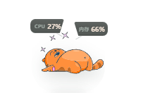
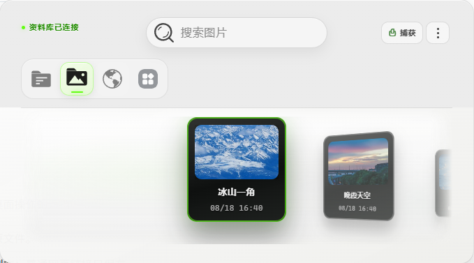
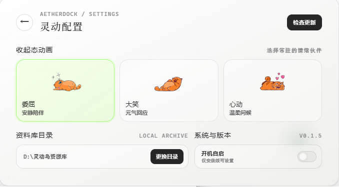

# AetherDock

> 把常用资料、链接与桌面应用收进一个随时可展开的桌面入口。

AetherDock 是一款面向 Windows 的桌面资料库。它以可自由拖动的桌宠常驻桌面，点击后会根据所在位置自适应展开资料库，用于管理本地文件、网页链接与桌面应用快捷方式。

**它不试图替代文件资源管理器。** 它更适合把分散但常用的内容收进一个轻量、可搜索、随时可用的入口。

## 应用预览

### 桌宠入口

<p align="center">
  
</p>

桌宠可以在屏幕安全边界内自由拖动。点击桌宠即可展开资料库，CPU 与内存状态会在桌宠上方轻量展示。

### 资料库



资料库支持按类型浏览、搜索、捕获剪贴板内容，并以卡片形式管理常用图片、文档、链接和桌面应用。

### 灵动配置



可以切换桌宠收起动画、调整资料库目录，并管理开机启动与版本更新。

## 功能一览

| 能力 | 实际行为 |
| --- | --- |
| 桌宠入口与自适应窗口 | 桌宠可在屏幕安全边界内自由拖动；点击后根据当前位置自适应展开资料库，减少对标题栏与桌面操作的遮挡。 |
| 系统状态 | 桌宠上方轻量展示 CPU 与内存占用；拖动期间保留最近一次数据，并暂停非必要动画。 |
| 资料归档 | 支持拖入本地图片、文档和网址；本地文件默认建立路径引用，不复制原文件。 |
| 网络文件拖入 | 可直接拖入网络图片或文档链接，应用会校验后下载为资料库中的受管副本；普通网页链接只保存为网址收藏，不会擅自下载网页内容。 |
| 剪贴板捕获 | 可捕获剪贴板中的截图、网址或文本，并分别归档为图片、链接或文本笔记。 |
| 桌面应用 | 扫描当前用户与公共桌面的 Windows 快捷方式，展示对应应用入口与原生图标。 |
| 搜索与批量操作 | 可按分类浏览、搜索、批量删除，也可定位原始文件或快捷方式。 |
| 快捷分享 | 文件会写入 Windows 文件剪贴板，网址会复制为文本，方便粘贴到聊天软件或其他应用。 |

## 适用场景

- 在项目文件、截图、参考链接之间频繁切换时，快速找到常用内容。
- 将桌面应用快捷方式集中到资料库，而不是让桌面不断堆积。
- 保存临时看到的网页、截图和文本，之后再统一整理。

## 安装与使用

### 下载已发布版本

从 [Releases](https://github.com/machho18/aether-dock/releases) 下载 `AetherDock Setup <版本号>.exe` 并运行。

- 安装器支持选择安装位置。
- 首次使用时选择资料库目录。
- 当前发布包面向 Windows x64。
- 当前安装包尚未进行数字签名，Windows 可能显示 SmartScreen 风险提示；这是未签名桌面应用的正常现象，请确认下载来源为本仓库的 Releases 页面。
- 如安装程序无法运行，请右键安装文件，选择“属性”，勾选“解除锁定”后点击“应用”，再重新运行安装程序。

### 资料与卸载说明

- 资料库文件与原始资料由用户选择的资料库目录管理。
- 卸载 AetherDock 时，资料库中的文件和原始资料**不会**被删除。
- 应用设置、索引数据库与缓存会被清理；如需保留索引状态，请先备份应用数据目录。

## 技术栈

| 层级 | 技术 |
| --- | --- |
| 桌面运行时 | [Electron](https://www.electronjs.org/) 43 |
| 界面 | [Vue 3](https://vuejs.org/) + Composition API |
| 构建 | [Vite](https://vite.dev/) |
| 样式 | [Tailwind CSS](https://tailwindcss.com/) 与局部 CSS 动效 |
| 本地数据 | Node.js `node:sqlite`（仅主进程访问） |
| 打包 | [electron-builder](https://www.electron.build/) + NSIS |

## 本地开发

### 环境要求

- Node.js 24 或更高版本
- Windows x64（桌面快捷方式扫描与文件分享依赖 Windows 系统能力）

### 启动

```powershell
git clone https://github.com/machho18/aether-dock.git
cd aether-dock
npm install
npm run start
```

### 打包

```powershell
npm run package
```

安装包会输出到 `release/` 目录。

### 开发与生产数据隔离

为避免调试影响已安装版本，开发与生产使用独立数据库：

```text
开发环境：%APPDATA%\aether-dock-dev\aether-dock.dev.db
生产环境：%APPDATA%\aether-dock\aether-dock.db
```

开发与生产还会使用各自独立的应用缓存目录；卸载生产版不会影响开发环境数据。资料库文件本身仍由你在应用内选择的位置管理。

## 数据与隐私边界

- 资料库索引保存在本机 SQLite 数据库中，渲染层不直接访问数据库或文件系统。
- 本地文件默认只记录引用路径；删除资料库条目不会删除原始文件。
- 导入网络图片或文档、读取网站图标时需要网络连接；普通网页链接仅作为收藏保存。
- 如果资料库文件仍在但数据库是新的，重新选择资料库目录会重建其中图片和文档的索引；网址收藏、文本笔记与快捷方式仅存于数据库，无法由资料目录恢复。

## 参与贡献

欢迎提交 Issue 和 Pull Request。请从当前稳定主干 `master` 创建 `feat/xxx` 或 `fix/xxx` 分支，完成后通过 Pull Request 合并。具体流程见 [贡献指南](./CONTRIBUTING.md)，安全问题请遵循 [安全策略](./SECURITY.md)。

在提交前请至少执行：

```powershell
npm run build
npm audit
```

## License

本项目采用 [MIT License](./LICENSE) 开源。
